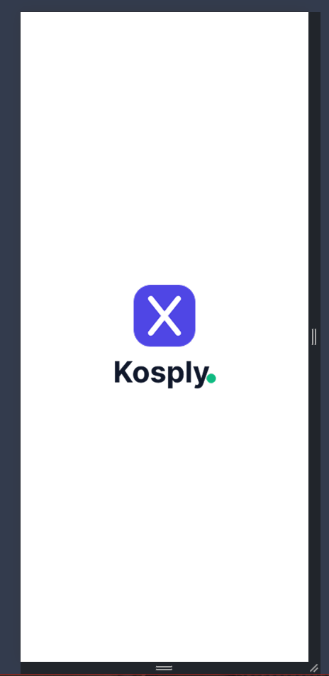
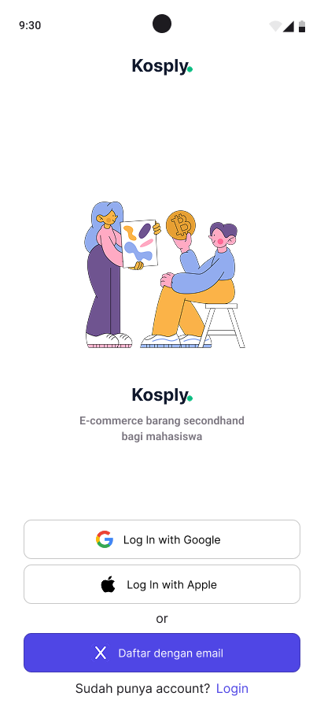
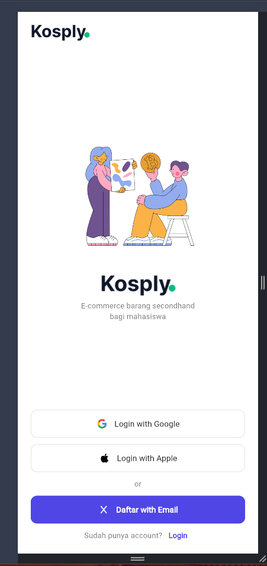
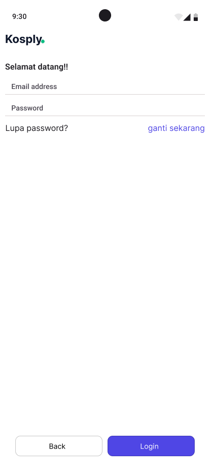
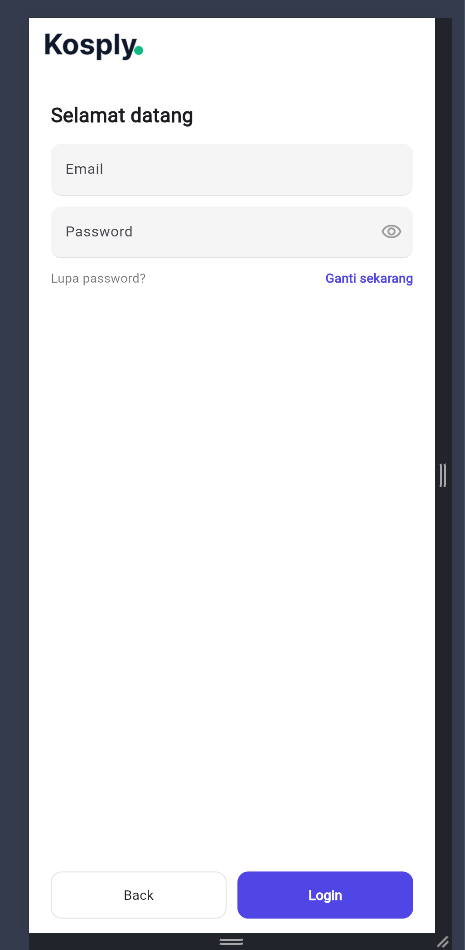

# Kosply — Flutter Learning (slicing-ui)

Secondhand goods e-commerce for students. UI slicing from the PBL UAS Figma design: **Splash → Register → Login**.

> **Figma:** [Kosply mobile design](https://www.figma.com/design/TkunWRuVgaA6JapwO536j0/Kosply-mobile-design?node-id=28-694&p=f&t=pBTeqIGpG67V5TIH-0)

## Design results (Figma vs Slicing)

| Screen | Figma | Slicing |
|---|---|---|
| Splash |  |  |
| Register |  |  |
| Login |  |  |

## Application flow (login > logout)

| Step | Screen | What happens |
|---|---|---|
| 1 | Splash | Brand logo with 800ms fade + scale entry animation, then auto-navigates to Register after 2 seconds |
| 2 | Register (signed out) | Shows Google / Apple / `Daftar with Email` buttons plus the `Login` link |
| 3 | Login | Enter email + password, press `Login`. `Back` returns without signing in |
| 4 | Register (signed in) | After a successful login the app returns here showing `Signed in as <email>` — no need to register again |
| 5 | Logout | Press `Logout` on Register to clear the session and return to the signed-out state |

## Architecture

```
lib/
  main.dart                        # MyApp + Provider registration
  models/user_model.dart           # UserModel (pure data, no Flutter import)
  controllers/auth_controller.dart # AuthController (ChangeNotifier, SEPARATE from UI)
  screens/
    splash_screen.dart
    register_screen.dart
    login_screen.dart
assets/images/                     # kosply_icon/logo, register_illustration, google/apple icons
test/
  auth_controller_test.dart        # global-state unit tests
  widget_test.dart                 # widget + flow tests
```

## State management

- **Global — Provider (`AuthController`):** login status (`isLoggedIn`, `user`, `error`) shared across screens. Signing in on `LoginScreen` reflects instantly on `RegisterScreen` (`Signed in as …` + `Logout`) via `notifyListeners`. Kept in `lib/controllers/` per the separation requirement.
- **Local — `setState`:** password visibility toggle (eye icon) in `LoginScreen`, splash delay timer in `SplashScreen`.

## Advanced UI & animation

- The Register middle section uses `CustomScrollView` + `SliverFillRemaining` (slivers) rendering **pixel-identical** visuals — centered on tall screens, scrollable on small ones. No design change.
- The Splash logo plays a basic entry animation: 800ms fade (0→1) + scale (0.95→1.0) with `Curves.easeOut` (`lib/screens/splash_screen.dart`).

## Code docs

Every Dart file is documented in **NatSpec style (English)**: `/// @title`, `@notice`, `@dev`, `@param`, `@return`, `@author`.

## Setup / run / test

```bash
flutter pub get
flutter run                 # mobile / desktop
flutter run -d chrome       # web (hard refresh with Ctrl+Shift+R on stale cache)
flutter analyze
flutter test
```
